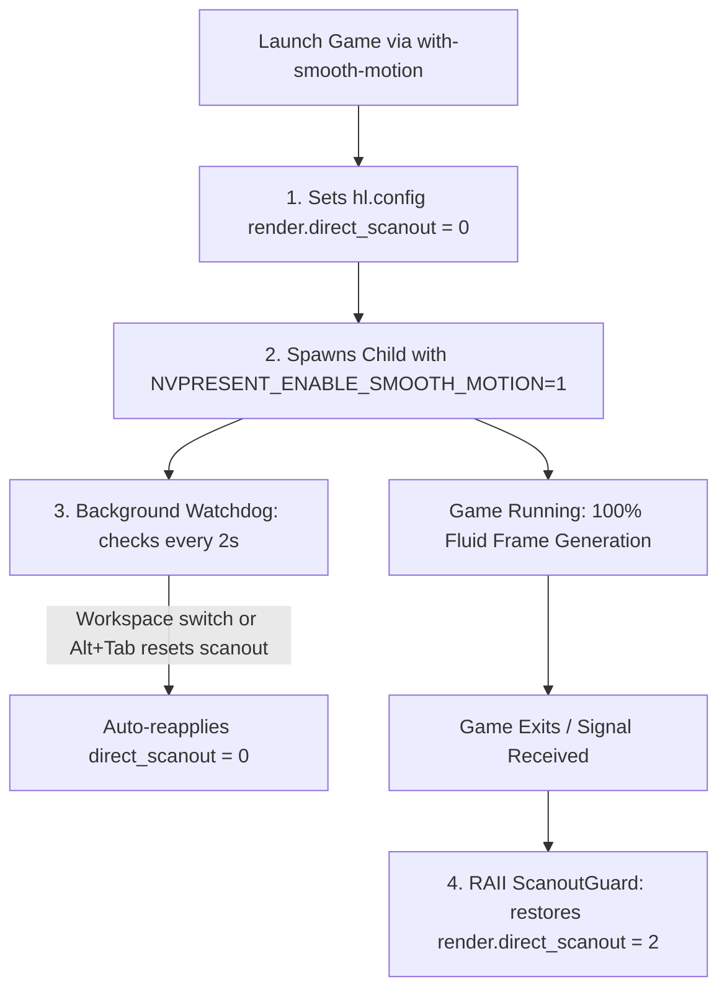

# WITH-SMOOTH-MOTION

[](https://github.com/ceduardorodrig/WITH-SMOOTH-MOTION)
[](LICENSE-MIT)
[](https://www.rust-lang.org/)
[](https://hyprland.org)

An adaptive, lightweight Wayland direct scanout manager and process wrapper written in pure Rust for running games with **NVIDIA Smooth Motion** (`NVPRESENT_ENABLE_SMOOTH_MOTION=1` via `VK_LAYER_NV_present`).

---

## 🎯 The Problem

When running Linux gaming setups on Wayland compositors (such as **Hyprland**) paired with modern NVIDIA RTX graphics cards (RTX 40 / 50 series):

1. **Direct Scanout Bypass:** By default, compositors enable direct scanout (`render.direct_scanout = 2` on Hyprland) when a fullscreen game starts, passing the KMS pageflip straight from the GPU to the display to minimize input latency.
2. **NVIDIA Smooth Motion Requirement:** NVIDIA's Vulkan Frame Interpolation layer (`VK_LAYER_NV_present`) **strictly requires compositor composition** to inject generated/interpolated frames into the presentation swapchain.
3. **The Collision:** When a game launches in fullscreen with direct scanout active, the presentation cadence collapses into an ABAB pacing loop, locking framerate to **half refresh rate** (e.g. 30 FPS on 60/72 Hz monitors) and causing severe input lag with minimal GPU utilization (~15%).
4. **The Flawed Workarounds:**
   - *Disabling direct scanout globally* in `hyprland.conf`: Ruins the latency benefits for the other 95% of games in your library.
   - *Running inside `gamescope`*: Introduces nested micro-compositor overhead and causes "elastic" frametime jitter when in-game VSync is disabled.

---

## ⚡ How `with-smooth-motion` Solves It

`with-smooth-motion` acts as an **adaptive compositor governor**:



- **Transparent Composition:** Sets `hl.config({ render = { direct_scanout = 0 } })` via Hyprland IPC only while the targeted game runs.
- **Alt+Tab / Workspace Switch Immune:** Includes an asynchronous watchdog thread checking compositor state every 2 seconds. If a workspace switch or compositor event re-enables direct scanout, the watchdog re-applies `0` in under 2ms.
- **Zero Overhead:** Native Wayland presentation via Proton (`winewayland.drv`) with no nested micro-compositors.
- **Guaranteed Cleanup (RAII):** Rust's `Drop` implementation ensures that whether the game exits cleanly, crashes, or is terminated by `SIGINT`/`SIGTERM`, `render.direct_scanout = 2` is immediately restored for all other games.
- **Compositor Agnostic Fallback:** If launched outside Hyprland (e.g. KDE Plasma or Sway), it sets the NVIDIA environment variables and launches without failing.

---

## 🛠️ Installation

### Build from source

Requires a standard Rust toolchain (MSRV: Rust 1.85+ / 2024 edition):

```bash
git clone https://github.com/ceduardorodrig/WITH-SMOOTH-MOTION.git
cd WITH-SMOOTH-MOTION
cargo build --release
sudo cp target/release/with-smooth-motion /usr/local/bin/with-smooth-motion
sudo chmod 755 /usr/local/bin/with-smooth-motion
sudo ln -sf /usr/local/bin/with-smooth-motion /usr/bin/with-smooth-motion
```

---

## 🎮 Steam Integration

### Standard Steam Game

In your Steam Game Properties → **Launch Options**:

```bash
PROTON_ENABLE_WAYLAND=1 /usr/local/bin/with-smooth-motion %command%
```

Or with CachyOS `game-performance` / power profile governor:

```bash
PROTON_ENABLE_WAYLAND=1 systemd-run --user --scope game-performance /usr/local/bin/with-smooth-motion %command%
```

### Modded Game with Custom Wrapper (e.g. Valheim via r2modman)

```bash
WINEDLLOVERRIDES="winhttp,version=n,b" PROTON_ENABLE_WAYLAND=1 systemd-run --user --scope game-performance /usr/local/bin/with-smooth-motion "/path/to/web_start_wrapper.sh" %command%
```

### In-Game Recommendations:
1. **In-game VSync:** **OFF** (prevents FIFO queue collisions with NVIDIA's present layer).
2. **In-game FPS Limiter:** **OFF / Unlimited**.
3. **Steam Overlay:** If experiencing assertion crashes when Alt-Tabbing on Wayland, toggle **Enable the Steam Overlay while in-game** to **OFF** in Steam game properties.

---

## 🔍 Telemetry & Logging

`with-smooth-motion` outputs real-time timestamped events to `/tmp/with-smooth-motion.log`:

```text
[1790145900] Starting command with Smooth Motion: [...]
[1790145900] render:direct_scanout set to 0
[1790145900] Child process started with PID 318079
[1790146860] Watchdog detected scanout reverted to 2. Re-applying 0...
[1790146860] render:direct_scanout set to 0
[1790147012] Child process finished with status: ExitStatus(0)
[1790147012] render:direct_scanout set to 2
[1790147012] ScanoutGuard drop: scanout restored to 2
```

---

## 📄 License

Dual-licensed under either:
- **MIT License** ([LICENSE-MIT](LICENSE-MIT))
- **Apache License, Version 2.0** ([LICENSE-APACHE](LICENSE-APACHE))

at your option.

---

<div align="center">

> **Yes... This is a Vibe Coded project**
>
> Governed by 🤖 **StenioSentinel** (our Rust-based AI Governance Sentinel) with **Carlos Eduardo Rodrigues** ([@ceduardorodrig](https://github.com/ceduardorodrig)).

</div>
